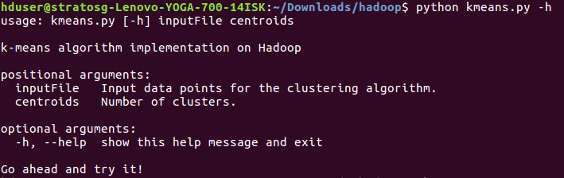

</img>
</img><br><br>
<br><br><br>
[](https://github.com/dbsmasters)


### <a id="contents" href="#contents">Contents</a>

1. [k-means algorithm implementation on Hadoop](#k-means-algorithm-impleme)
1. [Installing & Configuring Hadoop](#installing-configuring-ha)
1. [Running k-means on Hadoop](#running-k-means-on-hadoop)
1. [Testing functionality](#test-functionality)
1. [Team](#team)
1. [See also](#see-also)


### <a id="k-means-algorithm-impleme" href="#k-means-algorithm-impleme">k-means algorithm implementation on Hadoop</a>
> > MapReduce & k-means

The aim of this project is to implement k-means clustering algorithm on Hadoop. The project is implemented in the context of the course "Big Data Management Systems" taught by Prof. Damianos Chatziantoniou. In the repository the source code of the project as well as a presentation on the main steps followed during the project can be found. 

A detailed description of the assignment can be found [here](Proj1_Hadoop_Description.pdf).

### <a id="installing-configuring-ha" href="#installing-configuring-ha">Installing & Configuring Hadoop</a>

**1.** Download Hadoop from [Apache website](http://hadoop.apache.org/releases.html#25+August%2C+2016%3A+Release+2.7.3+available).
**2.** Download and install Java and Anaconda for Linux.
**3.** Install mrjob.
```shell
conda install mrjob
```
**4.** Configure Hadoop single-node cluster according to the following websites:
    1. [Hadoop configuration](http://www.michael-noll.com/tutorials/running-hadoop-on-ubuntu-linux-single-node-cluster/)
    2. [Hadoop mrjob configuration](http://stackoverflow.com/questions/25358793/error-launching-job-using-mrjob-on-hadoop)
    
### <a id="running-k-means-on-hadoop" href="#running-k-means-on-hadoop">Running k-means on Hadoop</a>

**1.** Clone this repository:
```shell
git clone https://github.com/dbsmasters/bdsmasters.git
cd /bdsmasters/
```
**2.** Run createDataPoints.py to create the input data points.
```shell
python createDataPoints.py input_data.txt 20000000
```
**3.** Calculate silhouette score to deterimine the optimal number of clusters.
```shell
python plotSilhouetteScore.py input_data.txt
```
**4.** Run kmeans.py to implement kmeans on Hadoop.
```shell
python kmeans.py input_data.txt 3
```



### <a id="test-functionality" href="#test-functionality">Testing functionality</a>

Test basic functionality of the program.
```shell
python test.py
```

### <a id="team" href="#team">Team</a>
|[](https://github.com/lamprini-koutsokera)|[](https://github.com/stratos-gounidellis)|
|---|---|
|[](https://github.com/lamprini-koutsokera)|[](https://github.com/stratos-gounidellis)|

### <a id="see-also" href="#see-also">See also</a>

External resources

* [Apache Hadoop Releases - hadoop.apache.org](http://hadoop.apache.org/releases.html)
* [Running Hadoop On Ubuntu Linux (Single-Node Cluster) - Michael G. Noll - www.michael-noll.com](http://www.michael-noll.com/tutorials/running-hadoop-on-ubuntu-linux-single-node-cluster/)
* [python - Error launching job using mrjob on Hadoop - Stack Overflow - stackoverflow.com](http://stackoverflow.com/questions/25358793/error-launching-job-using-mrjob-on-hadoop)
